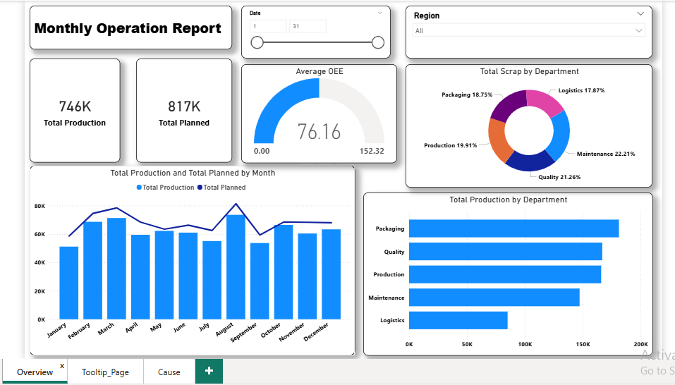
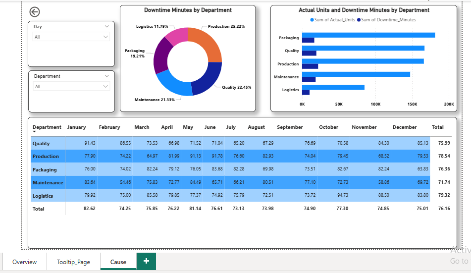

# Automated-Monthly-Operations-Report
This project focuses on automating the standard monthly reporting cycle for organizational operations. Traditionally a manual, error-prone task in Excel, this solution utilizes Power BI to provide a real-time, interactive dashboard that tracks resource utilization, financial health, and project milestones.

---

## 🎯 Objectives
- To provide real-time tracking of critical metrics such as Resource Utilization, Operating Margins, and Project Health.
- To enable stakeholders to perform "Root Cause Analysis" through interactive drill-downs and filtering rather than viewing static tables.
- To visualize month-over-month (MoM) performance and identify operational bottlenecks before they impact the bottom line.

  ---

## ⚙️ Data Preparation

### 🧼 Data Cleaning
- Brought consistancy in data ("quality" : "Quality", "Maint": "Maintenance")
- Fixed Date Column through New Column by example
- Filled null values

  ### 📈 Data Enrichment (Measures)
- Added DAX measures for:
  - `Average OEE`
  - `Total Planned`
  - `Total Production`
  - `Total Scrap`

 ---

 ## 📊 Dashboard Overview
 The dashboard consists of **two interactive pages**:

 ### 🧾 1. Overview Page

 

 A high-level overview with interactive KPIs, charts, filters, and navigation buttons.

 #### 🟢 KPIs
- Total Planned
- Total Production

#### 🎛️ Slicers / Interactive Buttons
Users can filter data by:
- Date
- Region

#### 📊 Charts & Visuals
1. **Donut Chart** – Total Scrap Produced by every department 
2. **Clustered Bar Chart** – Total Production By every department  
3. **Gauge Chart** – Average OEE  
4. **Line and Stacked Column Chart** – Total Production vs Total Planned

### 📋 2. Drillthrough Page
From total production by department user can drill through to see the cause of production failure and delay

A department-level data breakdown with interactive filters and detailed records.

#### 📊 Charts & Visuals
1. **Donut Chart** – Downtime minutes by every department 
2. **Clustered Bar Chart** – Actual Units and Downtime by Departments 
3. **Gauge Chart** – Average OEE By Department through out the year  

#### 🎛️ Slicers / Filters
Filter by:
- Day
- Department

---

## 📊 Dashboard Features

- **Interactive filters** for Day, Region, and Department.
- **Dynamic KPIs**: Total Production, Total Planned, and Average OEE.
- **Visuals**:
  - Bar chart of total production by department.
  - Pie chart of scrap by department.
  - Line/clustered visuals showing distribution and trends.

 ---

 ## 🔑 Key Insights

- Comparing the "North" vs. "South" regions to see which is generating higher revenue per employee.
- 91% of the production is achieved
- The downtime minutes of machinery significantly affects the production.

---

## ✅ Conclusion
The Automated Monthly Operations Report successfully transitions the organization from reactive to proactive management. By centralizing disparate data streams, the project achieves three primary outcomes:
1. Operational Efficiency
2. Strategic Resource Management
3. Financial Visibility

---

## 🚀 How to Use

1. Clone this repo or download the files.
2. Open `Project PowerBI.pbix` in **Power BI Desktop**.
3. Explore the slicers, charts, and KPIs for insights!

---

## 🛠 Tools Used

- **Power BI Desktop** – for data modeling and interactive dashboard creation  
- **Power Query** – for data transformation and cleaning

---

## 👤 Author
**Hamiz Ansari** 
- **GitHub:** [github.com/hamiz-21-7-06](https://github.com/hamiz-21-7-06)
- **Email:** [hamizansari06@gmail.com](hamizansari06@gmail.com)

## 🌟 Feedback & Support

Feel free to share suggestions or compliments — your feedback is appreciated!  
If you found this project useful, please consider giving it a ⭐️.
  
